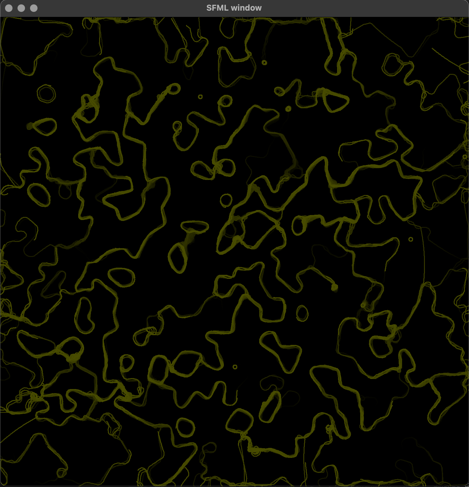
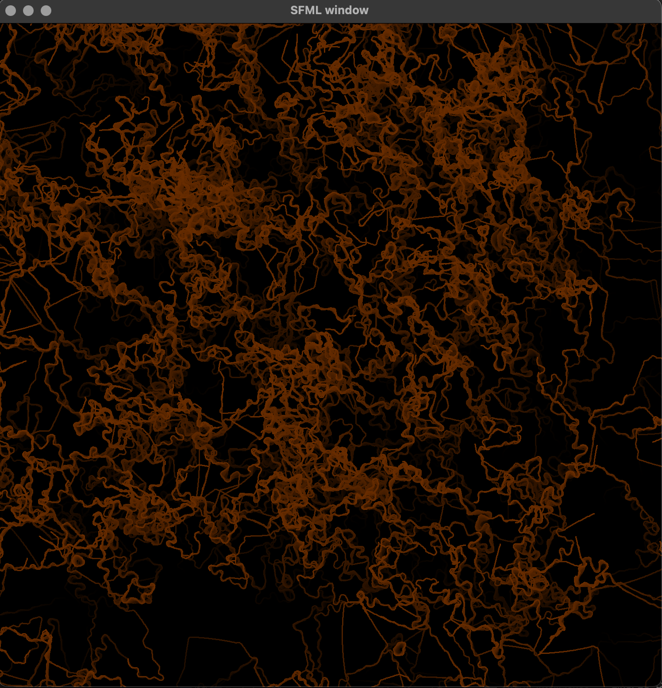
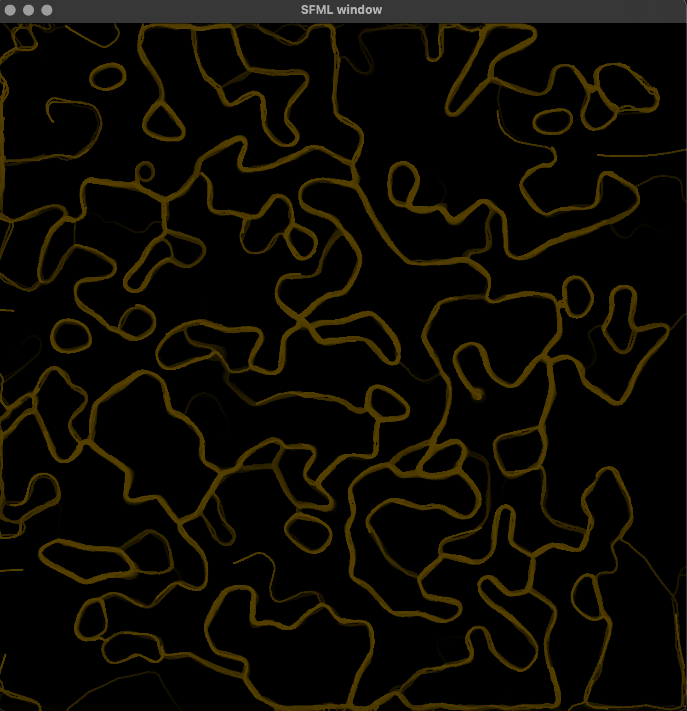

# Physarum Simulation

The program draws beautiful animated patterns, using concepts of swarm intelligence. The algorithm is known as **Physarum Simulation**.

## How it works

Patterns drawn in the window are vizualization of *substance*. The *substance* is emitted by some kind of organisms, called *agents*. 

Agents have three "eyes" - *detectors*. You can set length of agent's detector and the angle between
side detector and vertical detector (*_LENGTH*, *_ANGLE* parameters in Common.h). 

While moving, each agent emits the substance on the field. The amount of substance gradually decreases (adjusted by _DIFFUSION in Common.h).

If agent's detector finds more substance than the others, the agent changes its direction by constant value (*_dANGLE* in Common.h)

## Build

On Linux with installed SFML, from src folder run ``g++ -lsfml-system -lsfml-window -lsfml-graphics main.cpp SI/SIWindow.cpp SI/Agent.cpp -o visual-worms``
